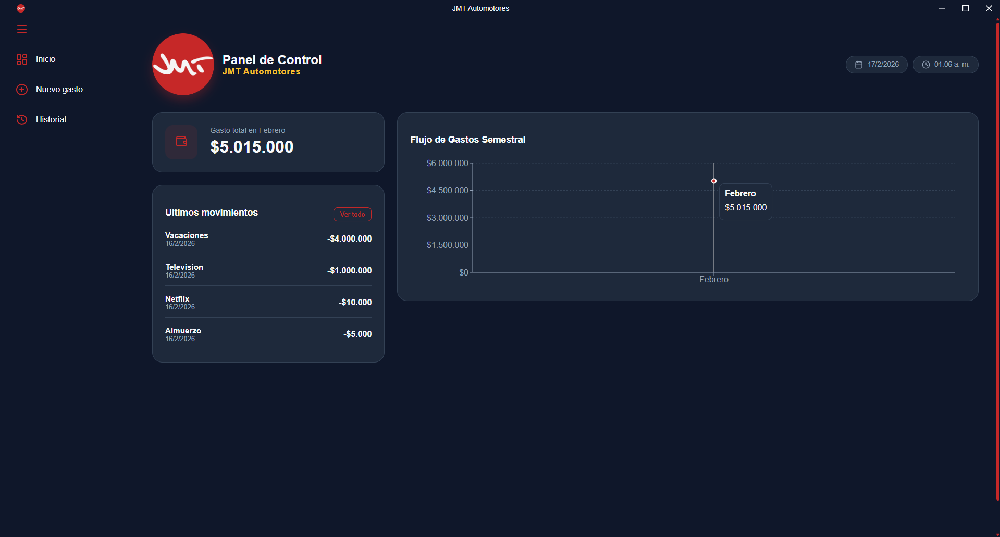
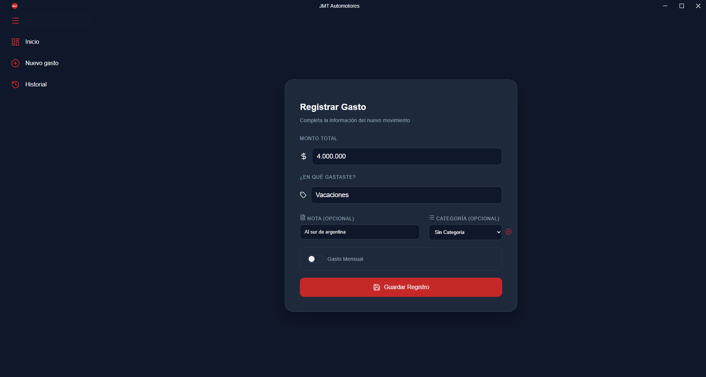
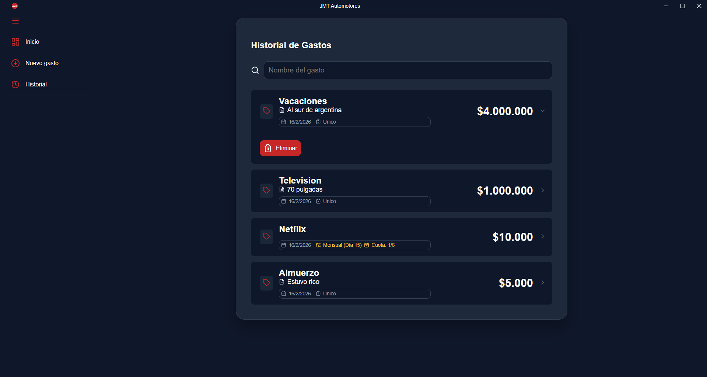

# Sistema de Gestión - Control Automotriz

**App Gastos** es una aplicación de escritorio desarrollada a medida para una empresa de venta automotriz. Su objetivo principal es la digitalización y el control centralizado de los movimientos financieros, automoviles, permitiendo una gestión eficiente de los gastos operativos, administrativos y de taller.

Construida sobre **Electron**, esta herramienta garantiza el rendimiento de una aplicación nativa con la flexibilidad de las tecnologías web, funcionando de manera local para asegurar la privacidad y rapidez de los datos.

## Contexto del Proyecto

Este software nace de la necesidad de optimizar el seguimiento de los flujos de dinero en la agencia. Permite a los administradores visualizar en tiempo real el estado financiero del negocio, controlando desde gastos menores de insumos hasta costos significativos de reparaciones y gestoría vehicular.

## Características Principales

- **Dashboard Financiero:** Visualización gráfica del balance de ingresos vs. egresos operativos mediante **Recharts**.
- **Gestión de Caja:** Registro detallado de movimientos (entradas por señas/ventas y salidas por repuestos/servicios).
- **Control de Gastos Operativos:** Categorización de gastos (Taller, Gestoría, Administración, Ventas).
- **Base de Datos Local Optimizada:** Almacenamiento seguro mediante **better-sqlite3**, ideal para entornos de oficina sin dependencia crítica de internet.
- **Seguridad en Operaciones:** Sistema de alertas y confirmaciones para evitar la eliminación accidental de registros contables importantes.
- **Reportes:** Capacidad de visualizar el histórico de transacciones para auditorías inter







## Próximas Implementaciones (Roadmap)

El proyecto se encuentra en evolución continua. Las siguientes funcionalidades están planificadas para las próximas versiones:

- **Digitalización de Comprobantes (Suba de Facturas):**
  Implementación de un sistema para adjuntar y almacenar facturas, recibos y tickets de compra directamente en cada transacción registrada, facilitando la auditoría contable.
- **Módulo de Inventario de Vehículos (Stock y Ventas):**
  Una nueva sección dedicada al control de la flota. Permitirá:
  - Alta, baja y modificación de vehículos en stock (Marca, Modelo, Año, Kilometraje, Precio).
  - Estado del vehículo en tiempo real (Disponible, Señado, Vendido, En Taller).
  - Historial de reparaciones asociado a cada unidad.

- **Gestión Documental del Automotor:**
  Sistema de archivo digital para la documentación legal de cada unidad. Permitirá la subida y visualización de archivos (PDF/Imágenes) como:
  - Títulos de propiedad y Tarjetas Verdes/Azules.
  - Informes de dominio y libre deuda.
  - Formularios 08 y verificaciones policiales.

## Stack Tecnológico

La arquitectura del proyecto está diseñada para ser robusta, mantenible y escalable:

- **Core:** Electron
- **Frontend:** React + Hooks
- **Base de Datos:** better-sqlite3
- **Visualización de Datos:** Recharts
- **Estilos:** CSS Modules

## Instalación y Despliegue

Instrucciones para levantar el proyecto en un entorno de desarrollo o producción local:

1. **Clonar el repositorio:**

   ```bash
   git clone [https://github.com/cuni10/app_gastos2.git](https://github.com/cuni10/app_gastos2.git)
   cd app_gastos2
   ```

2. **Instalar dependencias:**
   Se requiere Node.js (v16 o superior recomendado).

   ```bash
   npm install
   ```

3. **Compilación de Base de Datos:**
   Para asegurar la compatibilidad de SQLite con la versión de Electron:

   ```bash
   npm run rebuild-sqlite
   ```

4. **Ejecución:**

   ```bash
   npm run dev
   ```

## Estructura del Proyecto

```text
app_gastos2/
├── src/
│   ├── main/           # Lógica del proceso principal (Backend local)
│   ├── renderer/       # Interfaz de usuario (React)
│   │   ├── components/ # Dashboard, Tablas de Gastos, Formularios
│   │   ├── styles/     # Estilos corporativos
│   │   └── App.jsx
│   └── database/       # Schemas y migraciones de SQLite
├── resources/          # Recursos estáticos
├── package.json
└── README.md
```

Desarrollado por [cuni10](https://github.com/cuni10)
